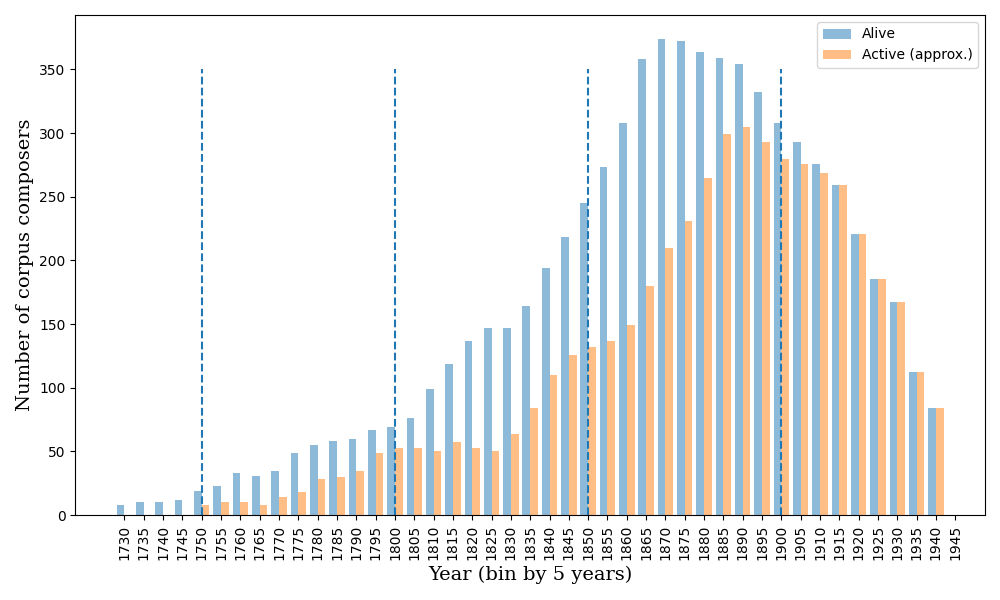
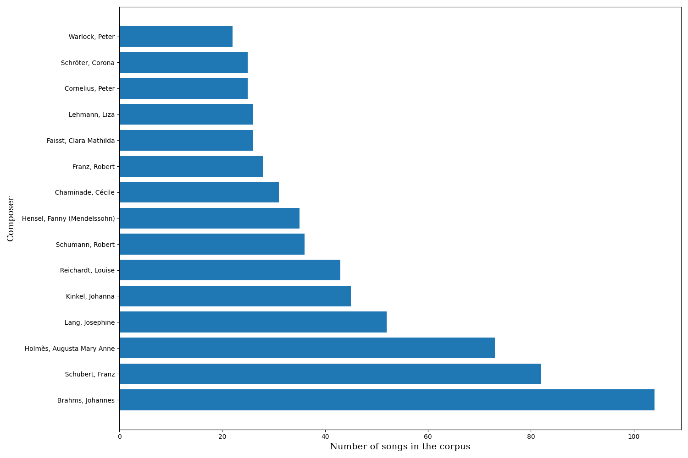
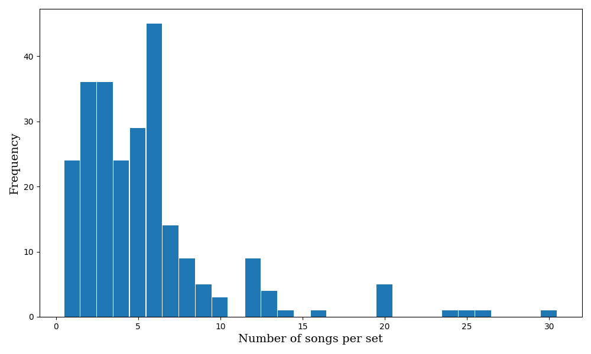

[OpenScore Lieder]
==================

[OpenScore Lieder]: https://musescore.com/openscore-lieder-corpus

Mirror of https://musescore.com/openscore-lieder-corpus

Collection of songs by 19th century composers in MuseScore format with associated data.

Scores can be downloaded individually in PDF, MIDI, MusicXML, MP3 and other formats from
their [official pages][OpenScore Lieder] on MuseScore.com. Alternatively, scores can be
converted to other formats *en masse* using MuseScore's free desktop software using either
the [Batch Convert Plugin] 
or the [command line interface][MuseScore Command Line] as explained below.

[MuseScore]: https://musescore.org/
[Batch Convert Plugin]: https://musescore.org/en/project/batch-convert
[MuseScore Command Line]: https://musescore.org/en/handbook/3/command-line-options#EXAMPLES

# Batch conversion with the [command line interface][MuseScore Command Line]

To convert the corpus using the [command line interface][MuseScore Command Line], you need a json file with in / out path pairs.
We provide such a file [here](./data/corpus_conversion.json) with the latest contents of the corpus, ready for converting the scores as given (mscx files) to mxl.
Implement the batch conversion with the current 
`corpus_conversion.json` from this folder with the command:
`mscore -j corpus_conversion.json`

We aim to keep this contents file up to date so you should not need to adjust it for simple conversions (of whole corpus from mscx to mxl).
That said, we also provide the means to do so if necessary: see [this script](./corpus_conversion.py).

To create a new / updated version of the `corpus_conversion.json`, run `python3 corpus_conversion.py` from this folder.

For conversion to another file format, before the relevant step/s above,
replace `.mxl` with the desired format (`.pdf` or `.mid`) either directly for every instance in the `corpus_conversion.json` file or
in the [corpus_conversion.py script](./corpus_conversion.py) (as the `out_format` in the `prep_conversion_doc` function).

# [Scores directory](./scores/)

Score and lyric files are arranged in the following directory structure:

```
<composer>/<set>/<song>
```

Directories:

- `<composer>` - composer's name in the form `Last,_First_Second...`.
- `<set>` - name of the extended work that the song belongs to, if any.
    - Standalone songs go in a set called `_` (i.e. a single underscore)
- `<song>` - name of the song, including a possible prefix.
    - Prefixes (such as 1, 2, 3a, 3b, etc.) are added to songs that have a
      defined order within the set. Prefixes are zero-padded (01, 02, ...,
      09, 10, 11, etc.) where necessary to ensure the correct sort order.

## Filenames

Score files within each song directory are named as follows

```
lc<id>.mscx
```

Filename components:

- `lc` - "Lieder Corpus"
- `<id>` - the score's unique Musescore ID
    - Corpus URL: `https://musescore.com/openscore-lieder-corpus/scores/<id>`
    - Or equivalently: `https://musescore.com/score/<id>`
- `.mscx` - the file extension for MuseScore's uncompressed score format.

## Lyric files

Lyric files follow the same naming format, with the extension `.txt`: 
i.e. `lc<id>.txt`.

These files provide the lyrics (a.k.a. poem, text) for each song separately 
as it appears in the score, to assist with cross-referencing and text-based studies.
The lyrics are as automatically extracted from each relevant part of every score.

## Automatic harmonic analyses

We also provide automatic harmonic analyses for each score in the
human- and computer-readable "Roman text" standard.
Files are named `analysis_automatic.rntxt`.
For more information and more analyses in this format,
see the [When in Rome meta-corpus repository](https://github.com/MarkGotham/When-in-Rome).

## Unicode characters in file paths

With the exception of a few unsafe or illegal characters, names of songs,
sets and composers have been left in their original forms.

Modern filesystems should have no problems with Unicode characters in
file paths. If the paths are displayed incorrectly by `git`, try setting:

```
git config core.quotePath false
```

Users on macOS may also need to set:

```
git config core.precomposeunicode true
```

__Tip:__ Add `--global` after `config` in the above commands to make `git`
behave this way by default for all repositories on your local machine.

# [Data directory](./data/)

The `Data/` directory contains the following:
- composers.tsv and composers.yaml: information about the corpus composers.
- corpus.tsv and corpus.yaml: total numbers of composers, sets, and scores.
- corpus_conversion.json: for batch conversion as described above.
- corpus_conversion.py: a basic script for updating the `corpus_conversion.json` file.
- plot.py: for producing the summative plots contained in ... 
- plots/: a folder for the summative plots as discussed below.
- scores.tsv and scores.yaml: information about each score
- sets.tsv and sets.yaml: information about each set (collection of scores).

## [Data plots](./data/plots/)

Summative plots of the corpus contents:

1. The number of corpus composers alive and active over time.


1. The number of songs by the top 15 most represented composers.


1. The number of songs per 'set' (a.k.a. 'collection', 'cycle').


# License and acknowledgement

These scores are released under Creative Commons Zero (CC0). See LICENSE.txt.

We kindly ask that you credit OpenScore Lieder and provide a link to
https://musescore.com/openscore-lieder-corpus or this repository for any public-facing use of these scores.

For academic publications, please cite one of these two as appropriate:
- Data directly: The specific release (with DOI) on Zenodo, e.g., https://doi.org/10.5281/zenodo.15450143
the report on this mirror we published in M.E.C.:
- Commentary: Gotham, M. R. H.; and Jonas, P. The OpenScore Lieder Corpus. In Münnich, S.; and Rizo, D., editor(s), Music Encoding Conference Proceedings 2021, pages 131–136, 2022. Humanities Commons. Best Poster Award. https://doi.org/10.17613/1my2-dm23. full bib.

```
@inproceedings{GothamJonas2022,
 abstract = {The OpenScore Lieder Corpus is a collection of over 1,200 nineteenth century songs encoded by a dedicated team of mostly volunteers over several years. Having reported on the initial phase, motivations, design, and community-oriented aspects of the project before, we present here the first, stable, large-scale release of this corpus specifically designed for MIR researchers, complete with comprehensive, structured, linked metadata. The corpus continues to be available under the open CC0 licence and represents a compelling dataset for a range of MIR tasks, not least given its unusual balance of large-scale with high-quality encoding, and of diversity (songs by over 100 composers, from many countries, and in a range of languages) with unity (centred on the nineteenth-century lieder tradition).},
 author = {Gotham, Mark Robert Haigh and Jonas, Peter},
 title = {{The OpenScore Lieder Corpus}},
 keywords = {mec-proceedings, mec-proceedings-2021},
 pages = {131--136},
 publisher = {{Humanities Commons}},
 isbn = {978-84-1302-173-7},
 editor = {M{\"u}nnich, Stefan and Rizo, David},
 booktitle = {{Music Encoding Conference Proceedings 2021}},
 year = {2022},
 doi = {10.17613/1my2-dm23},
 bibbase_note = {<span style="color: green; font-weight: bold">Best Poster Award.</span>},
 displayby = {Contributions from MEC 2021}
}
```

For some use / interest cases, you may also wish to check out either or both of: 
our initial 2018 report on the project,
and a 2021 discussion:
- Mark Gotham, Peter Jonas, Bruno Bower, William Bosworth, Daniel Rootham, and Leigh VanHandel. 2018. ‘Scores of Scores: An OpenScore project to encode and share sheet music.’ In Proceedings of the 5th International Conference on Digital Libraries for Musicology (DLfM’18). ACM, New York, NY, USA. https://doi.org/10.1145/3273024.3273026
- Gotham, M. Connecting the dots: Recognizing and implementing more kinds of “open science” to connect musicians and musicologists. Empirical Musicology Review 16 (2021). https://doi.org/10.18061/emr.v16i1.7644

## Credits and more about this corpus

These scores were transcribed by contributors to OpenScore Lieder, many of them after vocal line templates by Leigh Van Handel et al., and moderated by a professional team of proofreaders.

For more about this corpus, its motivations, how to contribute, who has contributed, and the funding that has supported this social initiative, please see https://fourscoreandmore.org/scores-of-scores/

## Summary of external links

- Scores on MuseScore: https://musescore.com/openscore-lieder-corpus
- Data on Zenodo: https://doi.org/10.5281/zenodo.15450143
- Academic report: https://doi.org/10.17613/1my2-dm23
- Motivation, explanation, credits, and more: https://fourscoreandmore.org/scores-of-scores/
